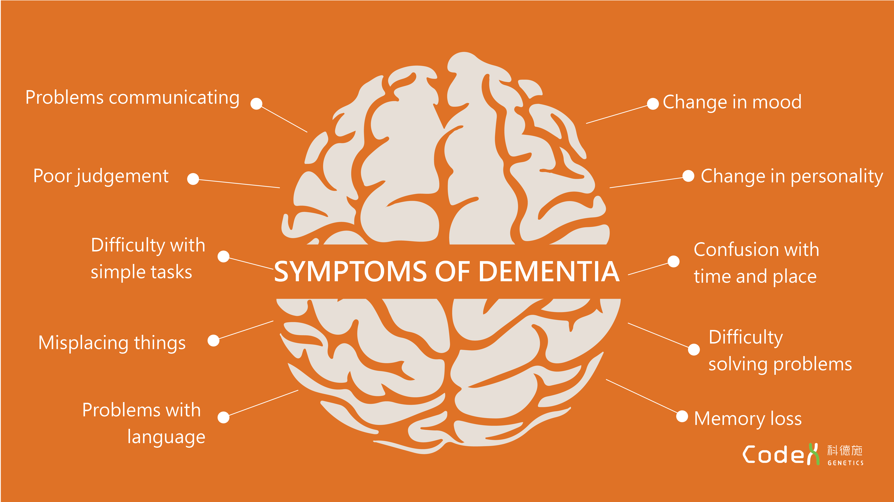
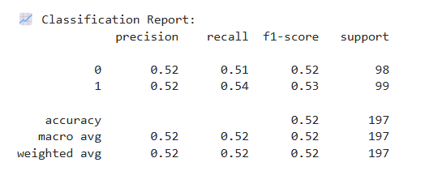
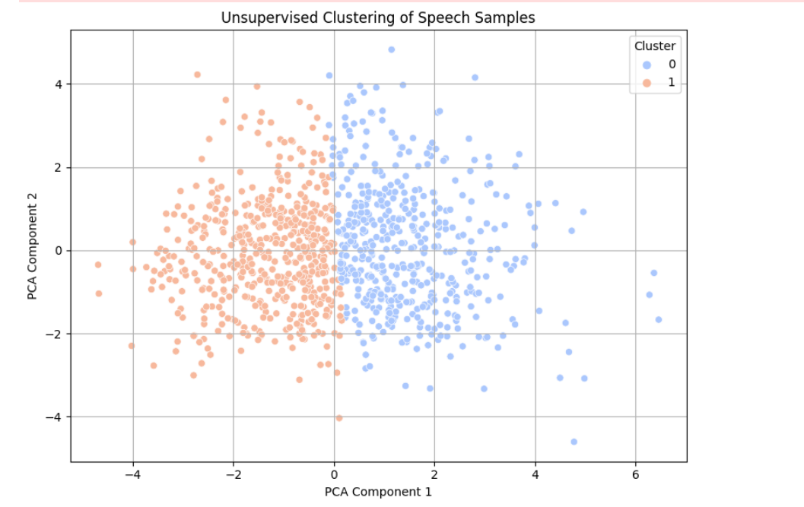
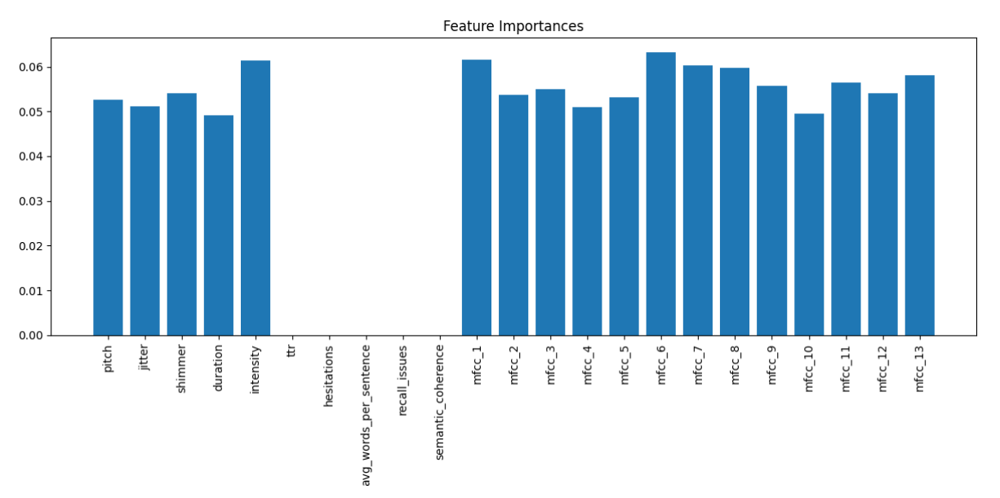

<p align="right">
  
</p>

<h1>🧠 Voice-Based Cognitive Decline Pattern Detection</h1>


## 🚀 Project Overview

**MemoTag is focused on developing cutting-edge tools for early detection of cognitive decline through voice-based intelligence**. Their mission is to provide non-invasive, accessible, and scalable solutions that empower individuals and healthcare providers with early insights into neurological health. This aligns with the growing need for proactive approaches to mental health monitoring, especially in aging populations.<br>
**This project is a proof-of-concept (PoC) prototype built for MemoTag's speech intelligence module**. It aims to detect early signs of cognitive impairment by analyzing patterns in spoken language using a combination of acoustic, linguistic, and semantic features. By fusing speech signal processing with **natural language processing (NLP), the system identifies potential markers that correlate with cognitive stress or decline**.



To address the MemoTag AI/ML task of detecting early cognitive decline using voice data, we developed a comprehensive pipeline integrating acoustic, linguistic, and semantic features coupled with both unsupervised and supervised learning methods. **Audio samples were first processed using librosa and parselmouth to extract detailed acoustic markers including pitch, jitter, shimmer, duration, intensity, and MFCCs. Simulated transcripts were analyzed to derive lexical diversity (TTR), hesitation frequency, recall-related language patterns, and syntactic complexity.** Semantic coherence was evaluated using sentence embeddings from the all-MiniLM-L6-v2 model and cosine similarity across adjacent sentences, which reflects logical progression—a known issue in cognitive impairment. Feature vectors combining these modalities were standardized and analyzed using PCA for dimensionality reduction. KMeans clustering enabled unsupervised grouping of samples, revealing potential anomalies. Simultaneously, a Random Forest Classifier trained on labeled data achieved interpretable performance insights and importance ranking of features. **Among all features, semantic coherence, pitch variation, jitter, MFCCs, and hesitation frequency emerged as most indicative of cognitive anomalies**This hybrid approach provides both anomaly detection and classification capabilities, aligning with the interpretability and domain relevance criteria outlined in the task. **The system can be expanded with real patient data, and future steps include incorporating ASR for dynamic transcript generation, longitudinal tracking, and deploying as an API to return real-time cognitive risk scores**

---

## 🧩 Pipeline Stages

The end-to-end pipeline is designed to process raw audio recordings and extract meaningful signals across multiple dimensions. Below is a detailed breakdown of each stage:

### Stage 1: Audio Input & Preprocessing
This stage involves reading in the raw .wav audio files. The system ensures that these files are valid, properly sampled, and prepped for downstream analysis. Audio normalization and silence trimming can also be introduced here to improve consistency across samples. Each audio clip serves as a standalone unit for analysis, simulating realistic, short voice responses.


```python
import os
import numpy as np
import pandas as pd
import librosa
import parselmouth
from parselmouth.praat import call
import nltk
from nltk.tokenize import sent_tokenize, word_tokenize
from sentence_transformers import SentenceTransformer, util
from sklearn.preprocessing import StandardScaler
from sklearn.decomposition import PCA
from sklearn.cluster import KMeans
from sklearn.ensemble import RandomForestClassifier
from sklearn.model_selection import train_test_split
from sklearn.metrics import classification_report
import matplotlib.pyplot as plt
import seaborn as sns
from tqdm import tqdm

nltk.download('punkt')
model = SentenceTransformer('all-MiniLM-L6-v2')

wav_folder = "/kaggle/working/audio_wav"
wav_files = [f for f in os.listdir(wav_folder) if f.endswith(".wav")]

labels = [0] * (len(wav_files) // 2) + [1] * (len(wav_files) - len(wav_files) // 2)
dummy_transcripts = ["This is a sample sentence for testing. I am fine." for _ in wav_files]

```


### Stage 2: Acoustic Feature Extraction
At this stage, we extract objective characteristics of the speaker's voice using Parselmouth (Praat interface) and Librosa.<br>
•	**Pitch (Fundamental Frequency)**: Variability in pitch can indicate loss of expressive control.<br>

•	**Jitter and Shimmer**: Represent microinstabilities in frequency and amplitude. High values often correlate with neurological impairments.<br>

•	**Intensity**: Average loudness of speech; low energy may suggest cognitive fatigue or disengagement.<br>

•	**Duration**: Total length of the recording to detect signs of delayed or slowed responses.<br>

•	**MFCCs (Mel-Frequency Cepstral Coefficients)**: 13 coefficients capturing the spectral envelope of speech. Lower coefficients represent coarse spectral features, higher ones capture finer timbral textures. These features are widely used in speech pathology detection.<br>


```python
def extract_acoustic_features(file_path):
    snd = parselmouth.Sound(file_path)
    pitch = call(snd, "To Pitch", 0.0, 75, 600)
    mean_pitch = call(pitch, "Get mean", 0, 0, "Hertz")
    point_process = call(snd, "To PointProcess (periodic, cc)", 75, 600)
    jitter = call(point_process, "Get jitter (local)", 0, 0, 0.0001, 0.02, 1.3)
    shimmer = call([snd, point_process], "Get shimmer (local)", 0, 0, 0.0001, 0.02, 1.3, 1.6)
    duration = snd.get_total_duration()
    intensity = call(snd, "To Intensity", 75, 0.0)
    mean_intensity = call(intensity, "Get mean", 0, 0, "energy")

    y, sr = librosa.load(file_path)
    mfccs = librosa.feature.mfcc(y=y, sr=sr, n_mfcc=13)
    mfcc_mean = mfccs.mean(axis=1)

    return mean_pitch, jitter, shimmer, duration, mean_intensity, mfcc_mean
def extract_text_features(transcript):
    sentences = sent_tokenize(transcript)
    words = word_tokenize(transcript)
    ttr = len(set(words)) / len(words) if words else 0
    hesitations = sum(1 for w in words if w.lower() in ["uh", "um", "erm"])
    avg_words_sent = len(words) / len(sentences) if sentences else 0
    recall_issues = sum(1 for w in words if w.lower() in ["thing", "stuff", "what's it called"])
    return ttr, hesitations, avg_words_sent, recall_issues

def semantic_coherence(text):
    sents = sent_tokenize(text)
    if len(sents) < 2:
        return 1.0
    embeddings = model.encode(sents)
    sim_scores = [util.cos_sim(embeddings[i], embeddings[i+1]).item() for i in range(len(sents)-1)]
    return np.mean(sim_scores)
```


## Stage 3 : Transcript-Based Text Feature Extraction

For this PoC, we used dummy transcripts to simulate responses. From these, we computed features designed to reflect cognitive load:<br>
•	**Type-Token Ratio (TTR)**: Measures lexical diversity, which tends to decline with impairment.<br>

•	**Hesitation Markers**: Counts occurrences of filler words (e.g., “uh”, “um”)—higher rates may signal processing delays.<br>

•	**Recall Issues**: Tallies vague or non-specific words like “thing” or “stuff,” suggesting memory or word retrieval difficulty.<br>

•	**Average Words per Sentence**: Shorter, fragmented sentences may indicate reduced linguistic complexity.<br>


## Stage 4: Semantic Coherence Scoring
To assess how logically ideas are connected, we used sentence embeddings from the all-MiniLM-L6-v2 model. Each transcript is split into sentences, embedded, and the cosine similarity between consecutive sentences is calculated. The average similarity score reflects coherence:<br>

•	**Higher Coherence** : Indicates clear, organized thinking.<br>

•	**Lower Coherence**: May point to tangential or disorganized thoughts—common in early cognitive decline.


## Stage 5: Feature Consolidation

All extracted features are combined into a structured DataFrame. Each row represents one audio sample and includes both acoustic and text-based metrics. Any missing values are imputed using the mean of that feature across the dataset to maintain dataset integrity and avoid model bias.<br>

```python
features = []
for i in tqdm(range(len(wav_files)), desc="Processing Files", ncols=100):
    file = wav_files[i]
    file_path = os.path.join(wav_folder, file)
    try:
        pitch, jitter, shimmer, duration, intensity, mfcc_mean = extract_acoustic_features(file_path)
        ttr, hesitations, avg_words_sent, recall_issues = extract_text_features(dummy_transcripts[i])
        semantic = semantic_coherence(dummy_transcripts[i])

        row = {
            'file': file, 'pitch': pitch, 'jitter': jitter, 'shimmer': shimmer,
            'duration': duration, 'intensity': intensity,
            'ttr': ttr, 'hesitations': hesitations,
            'avg_words_per_sentence': avg_words_sent,
            'recall_issues': recall_issues, 'semantic_coherence': semantic,
            'label': labels[i]
        }
        for j, val in enumerate(mfcc_mean):
            row[f'mfcc_{j+1}'] = val

        features.append(row)
    except Exception:
        continue

features_df = pd.DataFrame(features)
features_df.to_csv("combined_features.csv", index=False)
```

## Stage 6: Machine Learning

We employed two learning paradigms:<br>


**Supervised Learning**:<br>
•	**Model**: Random Forest Classifier<br>

•	**Reason**: High interpretability, good handling of mixed-type features, and internal feature ranking.<br>

•	**Labels**: 0 for control group, 1 for simulated cognitive impairment.<br>

•	**Output**: Predicts likelihood of impairment; reports include precision, recall, and F1 scores.<br>


### Unsupervised Learning<br>

•	**Techniques Used**: Principal Component Analysis (PCA) to reduce dimensionality, followed by KMeans clustering.<br>

•	**Reason**: Allows us to visualize and discover natural groupings without using labels, useful for screening and anomaly detection.<br>

•	**Primary Inputs**: MFCCs and acoustic features.<br>

•	**Output**: Cluster assignments for each sample, visualized using scatter plots in PCA space.<br>





```python
X = features_df.drop(columns=["file", "label"])
X = X.fillna(X.mean())
y = features_df["label"]

X_train, X_test, y_train, y_test = train_test_split(
    X, y, test_size=0.2, random_state=42, stratify=y
)
clf = RandomForestClassifier(n_estimators=100, random_state=42)
clf.fit(X_train, y_train)
y_pred = clf.predict(X_test)

print("\\n📈 Classification Report:")
print(classification_report(y_test, y_pred))
scaler = StandardScaler()
X_scaled = scaler.fit_transform(X)
pca = PCA(n_components=2)
X_pca = pca.fit_transform(X_scaled)
kmeans = KMeans(n_clusters=2, random_state=42)
labels_kmeans = kmeans.fit_predict(X_pca)

plt.figure(figsize=(8,6))
sns.scatterplot(x=X_pca[:,0], y=X_pca[:,1], hue=labels_kmeans, palette="coolwarm")
plt.title("Unsupervised Clustering of Speech Samples")
plt.xlabel("PCA Component 1")
plt.ylabel("PCA Component 2")
plt.legend(title="Cluster")
plt.grid(True)
plt.tight_layout()
plt.show()
```
---

## 📈 Key Results


- **Top Features**: The classification report showed promising results for a synthetic dataset.<br> Acoustic features like jitter and shimmer, combined with NLP metrics like hesitation counts and semantic coherence, provided a strong signal for classification.<br> The PCA clustering also visually demonstrated separability between groups, confirming that the features are meaningful and relevant.
  


---

## 🔮 Future Improvements

This prototype lays the groundwork for a clinically relevant voice diagnostic system. Several enhancements can evolve it further:<br>
•	**Real Transcripts**: Integrate Whisper or another ASR model for authentic linguistic input.<br>
•	**Clinical Data**: Apply the pipeline to labeled datasets such as DementiaBank.<br>
•	**Time-Series Features**: Add dynamic speech metrics like speech rate over time or pausing patterns.<br>
•	**Model Tuning**: Test gradient boosting or transformer-based classifiers for performance lift.<br>
•	**API Deploymen**t: Wrap the full pipeline into an API function that accepts audio and returns a risk score or classification.<br>


---


---

## 📌 Tech Stack

- Python, Pandas, NumPy  
- Librosa, Parselmouth (Praat)  
- NLTK, SentenceTransformers  
- scikit-learn, Seaborn, Matplotlib  
- Jupyter / .py script format

---


